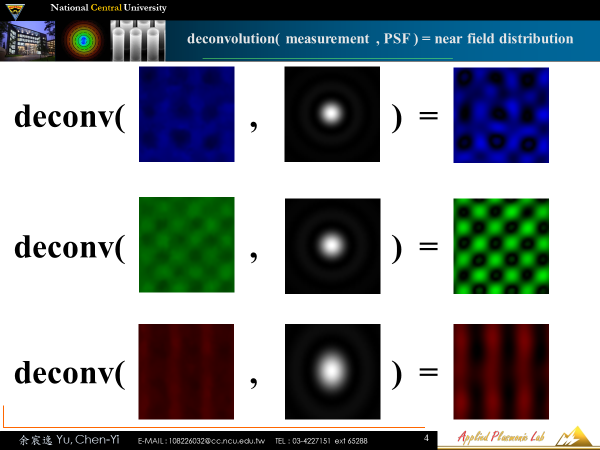
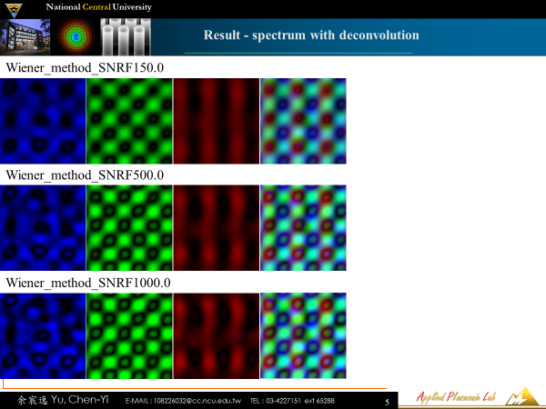
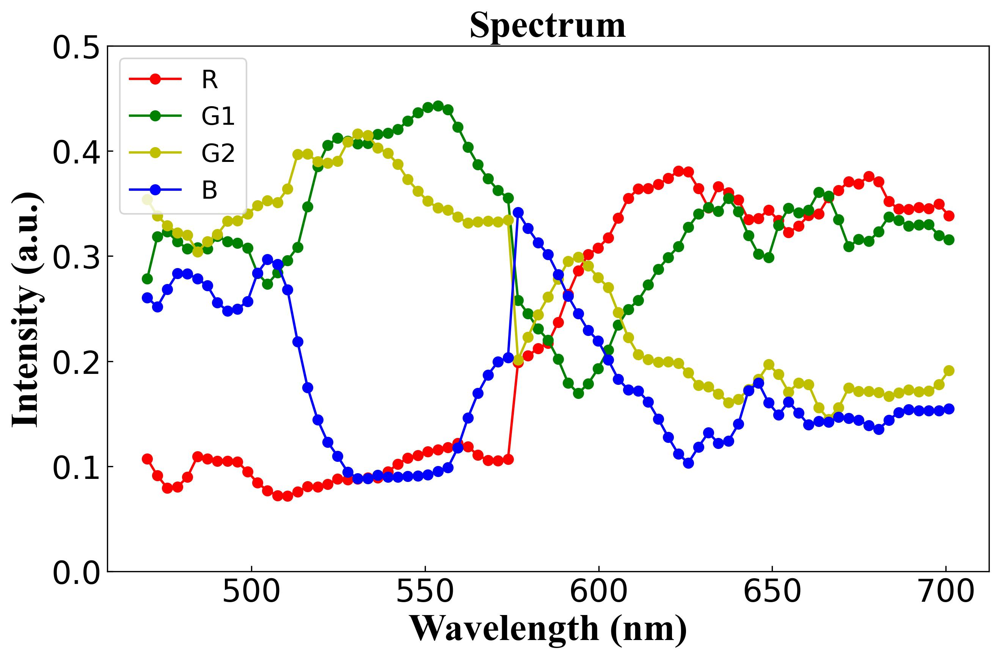

# HSI_deconv
High spectrum image deconvolution

這是一個高光譜顯微鏡與點擴散函數的解卷積的任務。顯微鏡影像存在物鏡的點擴散函數的捲積，要獲得真正的近場的能量分布必須與物鏡的點擴散函數做解卷積。

## 圖片展示

### 圖片1
將Cmos image sensor上的color router的顯微鏡影像與物鏡點擴散函數做解卷積得到近場的能量分布


### 圖片2
將Bayer array的R、G、G、B的能量分別積分算得各個通道的穿透率


### 圖片3


## 環境
- Python 3.7
- scipy
- numpy
- PIL
- imageio
- matplotlib
- openpyxl

## 安裝
你可以使用以下命令來安裝所需的套件：
```bash
pip install scipy numpy pillow imageio matplotlib openpyxl
